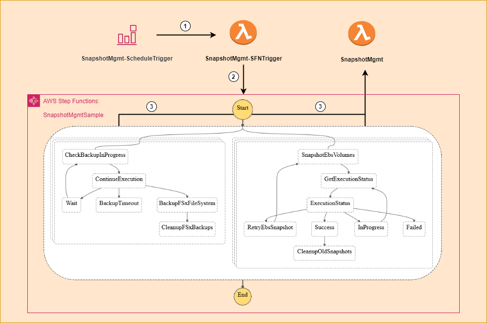

## FSx Backup and EBS Snapshot Management
--------------------------------------------------------------------
### Overview
This sample code will illustrate the use of several AWS services to build a simple data backup solution based upon FSx Windows FileSystem backups and EC2 EBS volume snapshots. It is geared toward Windows based environments, however the concepts could be adapted for other use-cases. The intent is as a data backup solution and not as a host level operating system backup solution. The solution is a combination of Cloudformation, Lambda, Step Function, Python, and Windows Powershell code.

This solution can be used as a backup strategy for non-production environments in order to keep costs down by alleviating the need to use your production level backup solution. This might also be a good fit for retaining multiple point in time backups which can be used to build or refresh environments for testing purposes, being able to roll forward or backward as needed by simply restoring the appropriate FSx backup or creating EBS volumes from the snapshots.

The sample code will also show how you might perform any required Pre or Post backup operations such as stopping a service or application prior to taking a snapshot and restarting them after the snapshot is complete.

### Prerequisites
The following items are required to deploy this solution for testing and evaluation purposes.
* Administrative permissions to your AWS account, or at least enough permissions to deploy Cloudformation templates, create IAM roles, Lambda functions, Step Functions, SSM Automation Documents and Eventbridge rules.
* An S3 bucket to upload the lambda code zip files to.
* One or more EC2 instances with additional EBS volumes attached. The EC2 instances need to have the tag below. This tag is used to locate the EC2 instances that should have snapshots created of their EBS volumes
  - Tag Key: 'ResourceType'
  - Tag Value: 'SnapshotMgmtTarget'
* One or more Windows FSx file systems. The file systems need to have the tag below. This tag is used to locate the file systems that should have backups created by this solution.
  - Tag Key: 'ResourceType'
  - Tag Value: 'SnapshotMgmtTarget'
### Workflow
1. The Amazon EventBridge scheduled rule will invoke the SnapshotMgmt-SFNTrigger lambda function. The lambda function can also be invoked manually for testing via the GUI or through an API or CLI call. The event data passed to the function is not important.
2. The SnapshotMgmt-SFNTrigger lambda will perform the following actions:
   1. Enumerate all FSx file systems, selecting those with a specific tag
   2. Enumerate EC2 instances, specifying a filter to select those with a specific tag
   3. Start the execution of the SnapshotMgmtSample step function, passing in the FSx file system and EC2 instance information as input
3. The SnapshotMgmtSample step function will execute two branches in parallel. One branch will perform all of the FSx file system operations and one branch will perform all of the EBS snapshot operations. Both branches will invoke the SnapshotMgmt lambda function to perform the various operations within the workflow.
   * The 'ProcessFSxFileSystems' branch will perform the following actions:
     1. In the 'CheckBackupInProgress' step, check if an FSx backup is already in progress for the specified file system. Only a single FSx backup can be taken at a time for a given file system.
     2. If a backup is already in progress, 'Wait' for 60 seconds and check again to see if a backup is still in progress. This wait/loop state can continue for up to 30 minutes at which time the 'BackupTimeout' step will be entered and the step function will fail.
     3. If no backup is in progress, the 'BackupFSxFileSystem' step will invoke the SnapshotMgmt lambda to create an FSx backup of the specified file system.
     4. The 'CleanupFSxBackups' step will search for FSx backups for the specified file system, locating backups that are older than the defined retention period, and deleting them.
   * The 'ProcessEc2Instances' branch will perform the following actions:
     1. The 'SnapshotEbsVolumes' step will execute an SSM automation document which will perform any pre/post snapshot steps as well as freeze the I/O to the EBS volumes and create a snapshot of each.
     2. The 'GetExecutionStatus' step will retrieve the execution status of the SSM automation document.
     3. Based upon the automation execution status the 'ExecutionStatus' step will
        1. Enter the 'InProgress' step and wait for 40 seconds before checking the execution status again.
        2. If the execution status returns a failed state, indicating that the EBS snapshot creation has failed, and this has occurred less than 5 times the 'RetryEbsSnapshot' step will execute the SSM automation document again to retry the snapshot process.
        3. If the execution status has failed 5 times the 'Failed' state will be entered and the step function will fail
        4. Upon successful EBS snapshot creation, the 'Success' step will pass the EC2 instance IDs to the 'CleanupOldSnapshots' step
     4. The 'CleanupOldSnapshots' step will search for EBS volume snapshots tagged with the EC2 instance ID, determining if the snapshots are older than the defined retention period and deleting them.

  

## Security

See [CONTRIBUTING](CONTRIBUTING.md#security-issue-notifications) for more information.

## License

This library is licensed under the MIT-0 License. See the LICENSE file.
